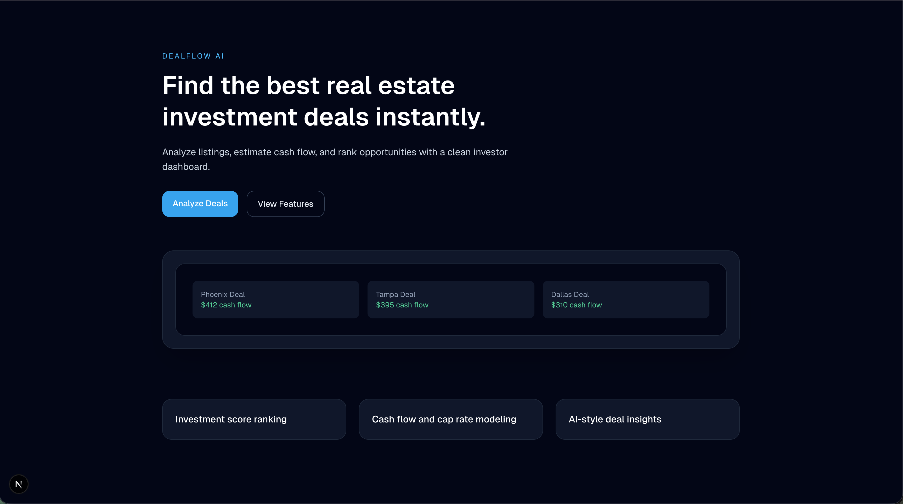
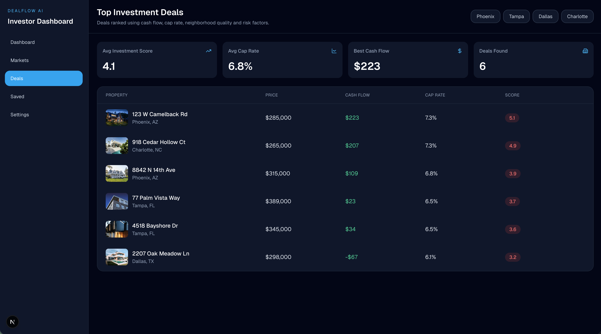
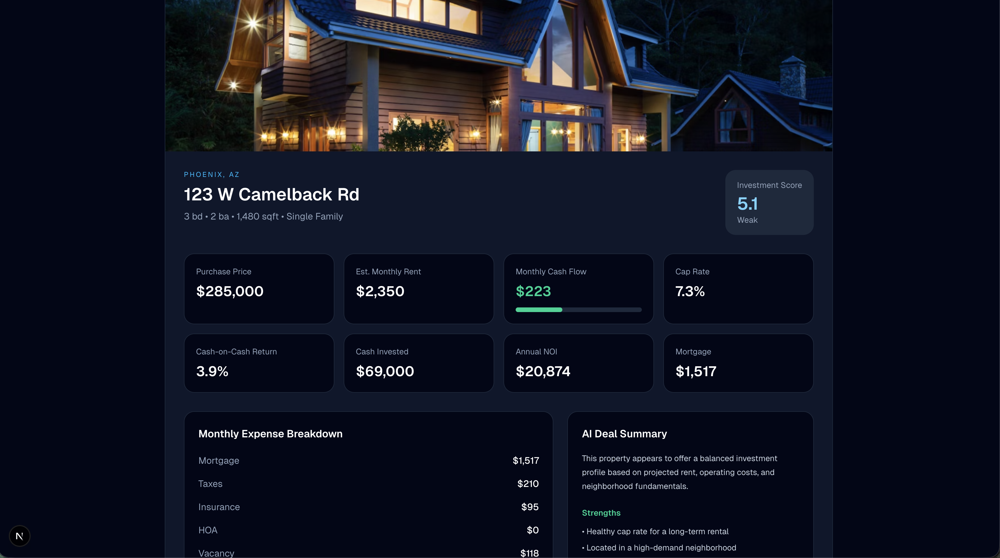

# DealFlow AI

AI-powered real estate investment analyzer that ranks property deals using projected cash flow, cap rate, and risk-adjusted scoring.

Live Demo  
https://your-vercel-url.vercel.app

## Overview

DealFlow AI analyzes real estate listings and calculates investment metrics to help investors identify the best opportunities in a market.

The dashboard ranks properties using a weighted scoring system based on:

- Monthly cash flow
- Cap rate
- Cash-on-cash return
- Neighborhood quality
- Risk factors

Users can explore properties and view a detailed financial breakdown including expenses, ROI metrics, and AI-generated deal insights.

## Features

- Investment deal ranking engine
- Cash flow and cap rate calculations
- Property analysis dashboard
- AI-style deal summaries
- Expense breakdown and ROI metrics

## Tech Stack

Frontend
- Next.js
- React
- TypeScript
- TailwindCSS
- shadcn/ui

Deployment
- Vercel

## Screenshots

## Future Improvements

- Real listing API integration
- Market trend analysis
- Saved deal tracking
- AI underwriting insights